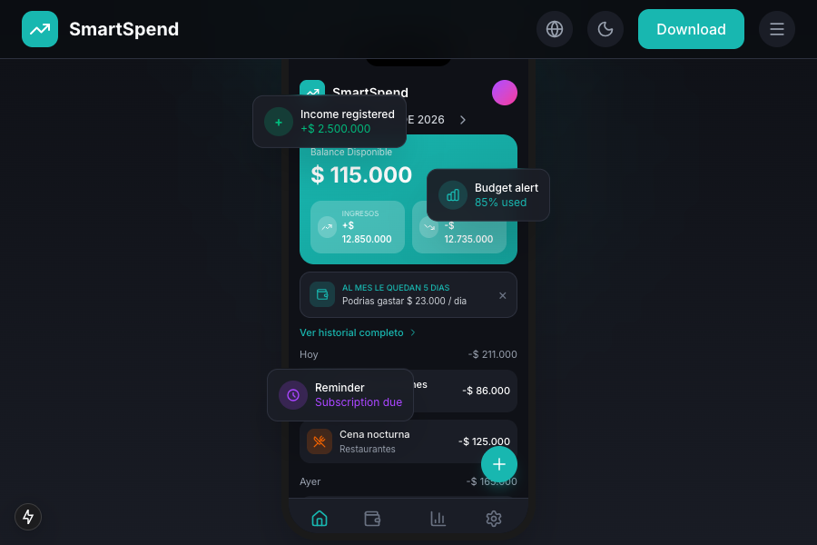

# SmartSpend Landing Page

[](https://nextjs.org/)
[](https://www.typescriptlang.org/)
[](https://tailwindcss.com/)
[](LICENSE)

Landing page oficial para **SmartSpend** - Una aplicación de control de gastos 100% offline y privada para iOS y Android.



## 🚀 Características

- **Multi-idioma**: Soporte completo para Español, Inglés, Francés y Portugués
- **Diseño Responsive**: Optimizado para todos los dispositivos
- **Modo Oscuro/Claro**: Cambio automático de tema
- **Página de Política de Privacidad**: Cumplimiento legal completo (GDPR, CCPA, COPPA)
- **Formulario de Contacto**: Con validación y rate limiting
- **Animaciones Suaves**: Usando Framer Motion
- **SEO Optimizado**: Meta tags dinámicas por idioma

## 📁 Estructura del Proyecto

```
web-kimi/
├── src/
│   ├── app/
│   │   ├── [locale]/           # Rutas internacionalizadas
│   │   │   ├── page.tsx        # Página principal
│   │   │   ├── contacto/       # Página de contacto
│   │   │   └── privacy-policy/ # Política de privacidad
│   │   ├── api/
│   │   │   └── contact/        # API endpoint para contacto
│   │   ├── globals.css
│   │   ├── layout.tsx
│   │   └── page.tsx
│   ├── components/
│   │   ├── sections/           # Secciones de la landing
│   │   │   ├── hero.tsx
│   │   │   ├── features.tsx
│   │   │   ├── privacy.tsx
│   │   │   └── footer.tsx
│   │   ├── app-screens/        # Mockups de la app
│   │   ├── privacy-policy-content.tsx
│   │   ├── header.tsx
│   │   └── ...
│   ├── i18n/                   # Configuración de internacionalización
│   └── lib/                    # Utilidades y schemas
├── messages/                   # Traducciones (i18n)
│   ├── en.json
│   ├── es.json
│   ├── fr.json
│   └── pt.json
├── docs/                       # Documentación y screenshots
└── public/                     # Archivos estáticos
```

## 🛠️ Tecnologías

- **Framework**: [Next.js 15](https://nextjs.org/) (App Router)
- **Lenguaje**: [TypeScript](https://www.typescriptlang.org/)
- **Estilos**: [Tailwind CSS 4](https://tailwindcss.com/)
- **Animaciones**: [Framer Motion](https://www.framer.com/motion/)
- **Iconos**: [Lucide React](https://lucide.dev/)
- **Formularios**: [React Hook Form](https://react-hook-form.com/) + [Zod](https://zod.dev/)
- **Email**: [Resend](https://resend.com/)

## 🚀 Empezar

### Prerrequisitos

- Node.js 18+
- npm, yarn, pnpm, o bun

### Instalación

1. Clona el repositorio:
```bash
git clone https://github.com/kevindrums92/smartspendweb-landing.git
cd smartspendweb-landing
```

2. Instala las dependencias:
```bash
npm install
```

3. Configura las variables de entorno (opcional para desarrollo):
```bash
# .env.local
RESEND_API_KEY=tu_api_key_de_resend
```

4. Inicia el servidor de desarrollo:
```bash
npm run dev
```

5. Abre [http://localhost:3000](http://localhost:3000) en tu navegador.

## 📄 Política de Privacidad

El proyecto incluye una página completa de política de privacidad que cumple con:

- **GDPR** (Reglamento General de Protección de Datos - UE)
- **CCPA** (California Consumer Privacy Act)
- **LGPD** (Lei Geral de Proteção de Dados - Brasil)
- **COPPA** (Children's Online Privacy Protection Act)

La página incluye:
- 11 secciones expandibles con información detallada
- Tabla de contenidos con navegación
- Información sobre recolección de datos
- Derechos del usuario
- Políticas de retención y eliminación
- Medidas de seguridad
- Transferencias internacionales
- Cookies y tecnologías de rastreo
- Protección de menores
- Información de contacto

## 🌐 Internacionalización

El sitio soporta 4 idiomas:
- 🇪🇸 Español (default)
- 🇺🇸 English
- 🇫🇷 Français
- 🇧🇷 Português

Las rutas se generan automáticamente:
- `/es` - Español
- `/en` - English
- `/fr` - Français
- `/pt` - Português

## 📦 Build y Deploy

### Build de producción:
```bash
npm run build
```

### Deploy en Vercel:
El proyecto está optimizado para deploy en Vercel:

[](https://vercel.com/new/clone?repository-url=https://github.com/kevindrums92/smartspendweb-landing)

## 📝 Licencia

Este proyecto está bajo la licencia MIT. Ver el archivo [LICENSE](LICENSE) para más detalles.

## 👤 Autor

**Kevin Rodriguez** - [@kevindrums92](https://github.com/kevindrums92)

---

<p align="center">
  Hecho con ❤️ para la comunidad financiera
</p>
